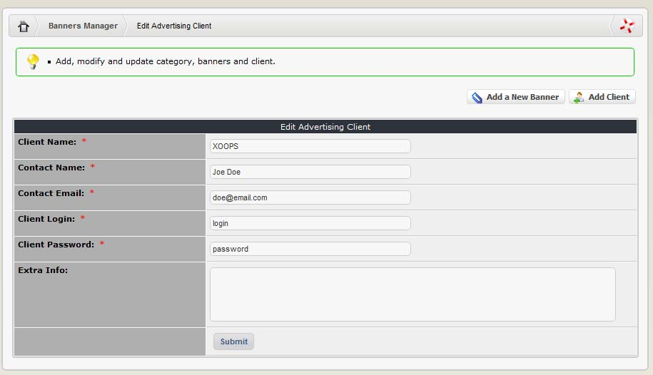
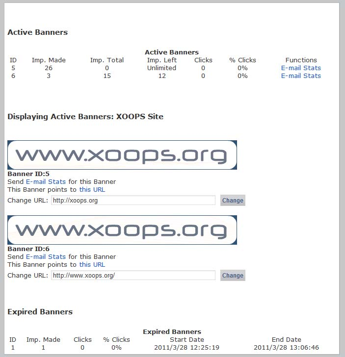

### 2.5.7	Add new client

Click the “Add Client” button and fill in the form to register new advertising clients. 

  
 
This creates an account that the client can login to view the current status of their banner advertisements:

| Field | Description |
| -- | -- |
| Client Name: | Normally the name of the company. |
| Contact Name: | Your contact at the company. |
| Contact Email: | 	Make sure you get this right. A summary of current banner statistics will be sent to this address when the client requests a status report (see ‘Client banner accounts’ below). |
| Client Login: | Assign a login name for your client here. You will have to inform clients of their login and password manually. This is entirely separate from the main site login system. |
| Client Password: | Assign a password for your client’s account here. The client cannot change this. Pick something secure. |
| Extra Info: | 	A discretionary ‘notes’ field, enter anything you like in here. |

Clients can check the status of their banners at any time by visiting http://www.yoururl.com/banners.php. This presents a login screen where the client must enter their login and password (assigned by you via the ‘add client’ form).

After login, clients are presented with a table summarising their banner statistics (described in ‘Current active banners’ above), and a display of their currently running banners. The ‘Email Stats’ link enables the client to send the current report, marked with a timestamp, to their contact email address. The client can re-point the banner to any URL they choose via the ‘Change URL’ box. This enables them to redirect the focus of their advertisement as needed.
 
   

***Figure 9 View of the banner***
 
