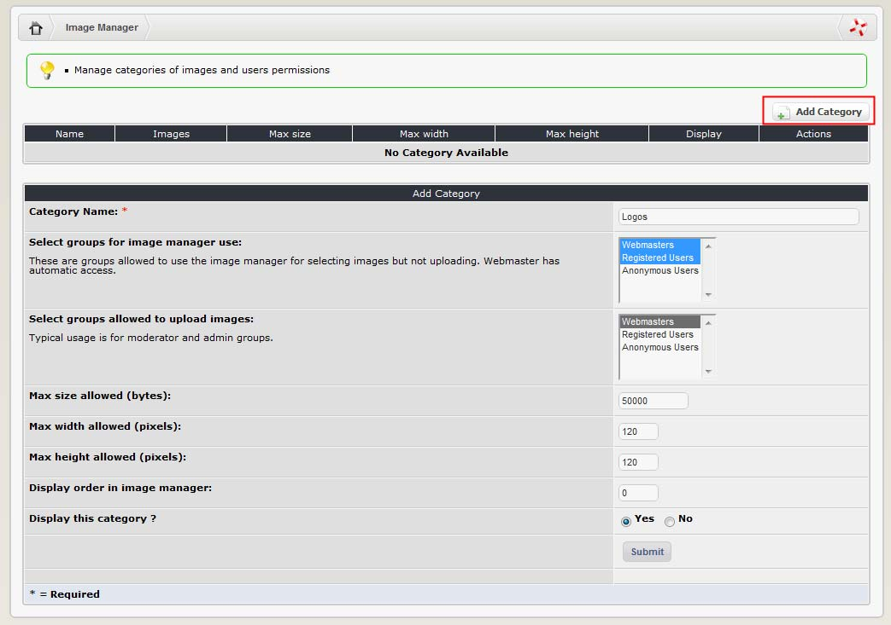
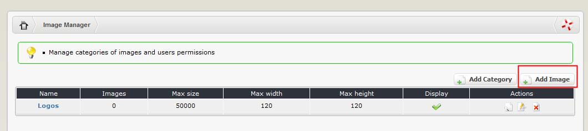

### 2.9.1	Adding image categories

You must create at least one category before you can upload images. 

  
 
The configuration options are summarised below:

| Field | Description |
| --- | --- |
|Category name:|	Give your category an appropriate name. Keep it short, as people will select it through a drop-down box.|
|Select groups for image manager use|	Select the user groups that you want to be able to access the images in this category. These groups will be able to see and select images (for use in submissions etc.) but cannot upload new images. The Webmaster group has access by default.|
|Select groups allowed to upload images:|	Select the user groups you want to permit to upload new images into this category. The default is upload by the Webmaster group only. Typically upload rights are given to trusted (administrative) groups only. Bear in mind that if you allow the general public to upload images they may send in some offensive ones.|
|Max size allowed (kb):	|It is useful to impose a limit on the file size uploaded images. This prevents people from posting ridiculously large images that are difficult to download. The default is 50,000 bytes (it is not KB as stated, that is an error).|
|Max width allowed (pixels):|	Set a maximum width on images to preserve the integrity of your layout. Consider what would happen if someone uses a 1024 pixel wide image on your 800 pixel wide site! If you have a ‘standard’ size you like to use for your site this is a good place to set it.|
|Max height allowed (pixels):|	As above.|
|Display order in image manager:|	You can set the order in which categories appear in the image manager drop down box here. If you want to have some flexibility in ordering the categories, assign them order numbers in (say) multiples of 10. That way you can always come back and insert a new category between them.|
|Display this category?	|The default is ‘yes’. If you choose ‘no’, the category will be hidden when people access the image manager from the user side. This can be useful for hiding administrative categories from your users.|

Once the new Category is submitted, we can see it in the list, and we can add images to it:

  
 
