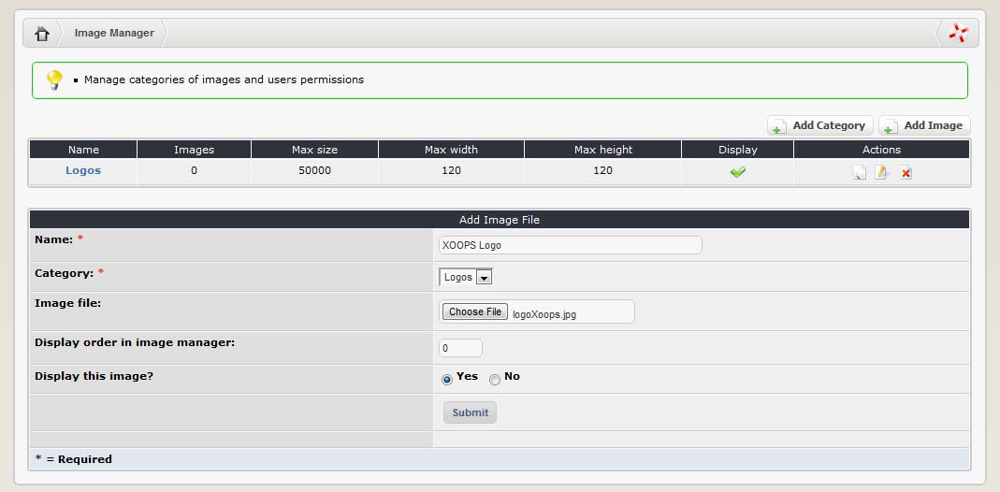
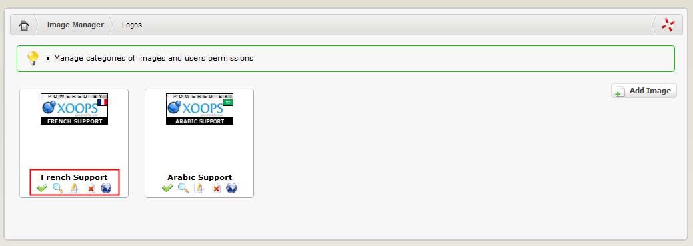

### 2.9.3	Adding image files through the control panel

You must create at least one category before you can upload images. Once this is done, you can add images to it:

   

|Field|	Description|
| -- | -- |
|Name:|	Give your category an appropriate name. Keep it short, as people will select it through a drop-down box.|
|Category:|	Choose the category that you want the image to be assigned to here.|
|Image file:|	Press the browse button and navigate to the image that you want to upload.|
|Display order in image manager:|	You can set the order in which images appear in the category here. If you want to have some flexibility in ordering the images, assign them order numbers in (say) multiples of 10. That way you can always come back and insert a new image between them.|
|Display this image?|	The default is ‘yes’. If you choose ‘no’ the image will be hidden when people access this category from the user side.|

Once submitted, we’ll have the image category screen with available images:

  
 
For each image you can:
-	make the image visible or not
-	view the image
-	edit the details about the image
-	delete the image
-	vie the image’s URL
