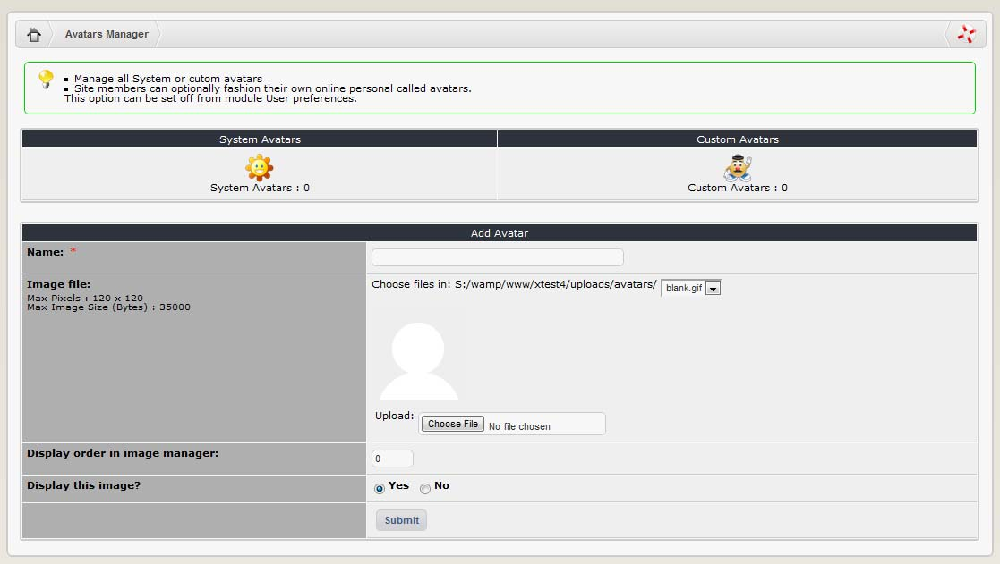

## 2.4 	Avatars

Avatars are small graphics or pictures that can be used in various content settings around the site. They are often used next to a user name to add a bit of ‘visual identification’. Typical applications are the forum.

The Avatar Manager allows the Site administrator to add, edit or delete System Avatars as well as Custom Avatars. System Avatars are images uploaded by the Site administrator in the Avatar Manager section. Custom Avatars are images directly uploaded by a user. For a user to be able to upload an avatar, the correct option must be configured in the User Info Settings of the Site Preferences.

  
 
