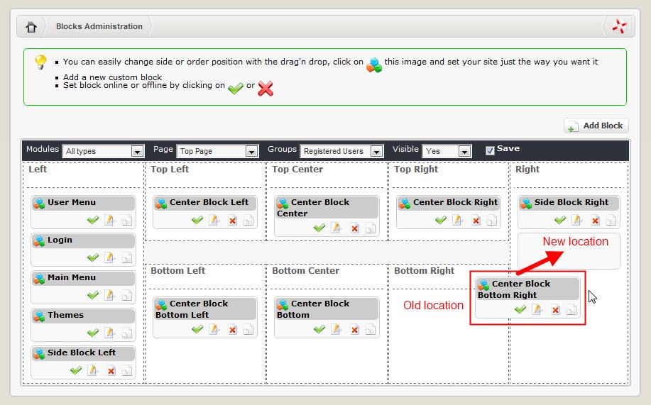
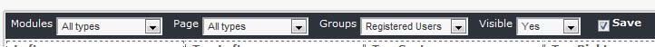

### 2.6.1	Overview

The Blocks Administration page allows the Site administrator to organize the blocks for every page in the site. 

  
 
***Figure 10 Block Manager main view***

In XOOPS 2.5.0 we have introduced for the first time “drag & drop” capability, i.e. you can drag individual blocks and drop them at the desired location (see above). 
The visibility of the blocks configured in the system is decided by four drop-down filter menu options at the top of the table: 

  
 
***Figure 11 Blocks Filtering***

The four drop-down combo boxes select options for “Modules”, “Pages”, “Group” and ‘Visible’. These options control much of the content and functions of the site, so it’s really worth getting familiar with this section. 

Let’s look at Figure 11. By default, the table will display the blocks that are defined to appear for the Registered Users and are currently set as “Visible”. Let’s have a look at some of the terms here.

**Menu 1. “Modules”**

This combo box selects which module we want to see. It shows all currently installed modules. We can select all, and just individual modules.

**Menu 2. “Page”**

This combo box sets the page where blocks are displayed. For example, the Top Page is the home page of the site. When a user types http://www.yoursite.com, the top page is what he sees. (This page can be set in the General Settings of the site). The other choices of this combo box will list the different modules of the site (Downloads, Web Links, Forum, etc…).

**Menu3. “Group”**

This combo box lists all the groups of the site. If the group ‘Webmaster’ is selected, the table will display all the blocks for which the Webmaster group has access. Please note that the blocks permissions are defined in the Groups section and discussed later in this guide.

**Menu 4. “Visible”**

The purpose of this combo box is simply to help the site administrator by filtering a specific visible status. This combo box has 3 items: ‘Yes’, ‘No’ and ‘All’. The table will display the blocks that have their visible property set to that value. If ‘All’ is selected, the table will return every block.
