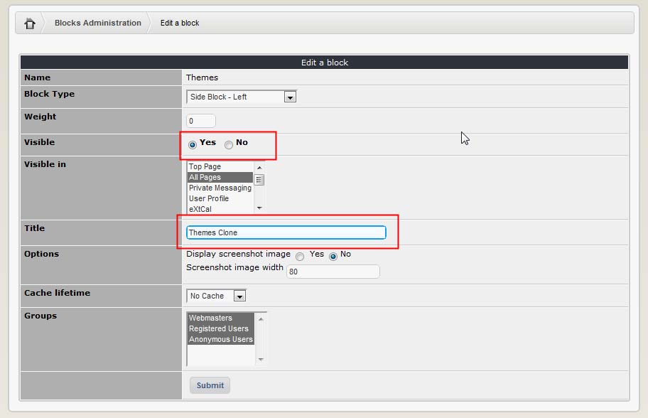
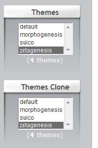

### 2.6.4	Cloning a block

The last block feature that we want to cover is cloning a block. Sometimes, we would like to have a block that is a variation of an existing block, so the question is – how can we “reuse” the existing one? It is done by cloning. As shown above, as part of every block there is an icon to clone the block:   

So let’s clone the Theme Block. After clicking on the “Clone” icon, we’ll get the block configuration screen. Let’s only change the name of the block and make it visible:

 
And let’s see the user side:

 	
 	
As you can see on the left, both blocks are working just fine. Of course, you can make more significant changes/modifications to the cloned block. 

