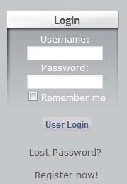

## 2.1 Logging in

The XOOPS content management system comes with an integrated membership registration section. Once registered, users can login by entering their username and password in forms displayed in a login block on the page. New registration is accomplished by pressing the “register now” link. This opens a page where an anonymous user may register by inputting basic details, like a user name and contact email. Registration allows access to restricted content of the site as defined by the site administrator. Site administrators can elect not to display the login form if they wish, or simply disallow registration. However the form is displayed on the home page by default on initial installation.

  

Login is required to access any restricted content of the site. Successful login is accomplished by inputting a correct username and password as confirmed during the registration process.

If an unregistered user submits a URL that deliberately or accidentally calls a file or page that is designated as 'restricted content', then the login page is automatically returned by default. This defeats the URL call until authorised access is confirmed by successful login.

Site administrators need to login to access the admin part of a site.

Registered users may login to access other parts of the site that have been designated as registered members content. Registered users may also be given extra rights, such as posting in forums, commenting and submitting news items etc.

Administrators of a site can also define extra-restricted areas (not accessible to registered members) that display unique content. They can then assign any registered member access rights to that area.

All these access features are defined and controlled in the 'groups' section in admin and are discussed in detail later in the manual.

For now let's describe the login procedure as follows:
* As site administrator
* As registered user
* Failed login procedure
* Logging out

