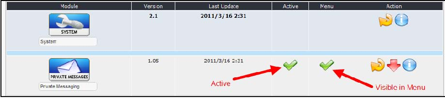
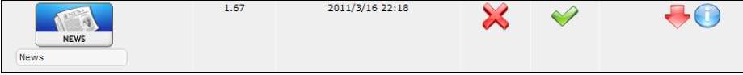
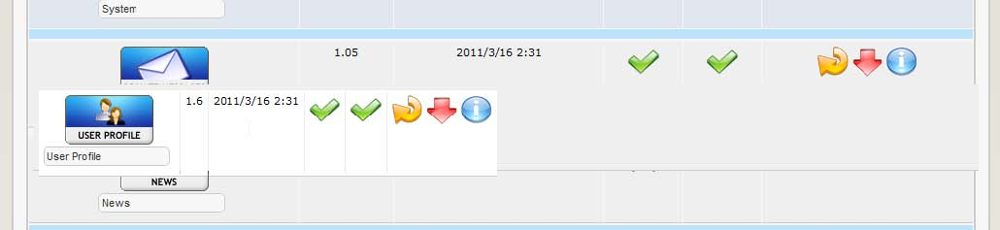
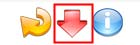
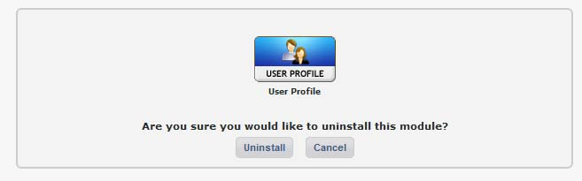

### 2.12.4	Setting module visibility and menu order

  
 
Figure 18 Module Activation and Main menu visibility

The modules administration table has headings for: Module, Version, Last Update, Active, and Action.

This page gives you options to ‘Activate’ the module in your website or keep it installed but hidden from any menus or interaction. You can also deactivate the module from this page (or uninstall altogether, as we will describe later.)

The green “checkmarks” in the 'Active’  and “Menu” columns indicated that the module is active in your website and admin section and also visible in your menu systems. Remember, you still need to select in which pages, position and groups the module will appear in. By clicking on the green checkmark will change the status to “deactivated” indicated by the “off” icon. 

The same is for “Menu”. But changing the status to “off” will keep the module active, but prevent any links appearing in the page menu systems. This is useful if you utilize custom menus or links to display pages.
 
   
Figure 19 Deactivated module.

You can also change the order of the modules in the menu by simply dragging them up or down. As soon as you drop the module, the new order will be reflected in the Menu. Here we’re dragging the “User Profile” to be above “Private Messaging” and the change is reflected right away in the Menu:
   
  

**Deactivating and uninstalling a module**

While we are still in the module administration page, let’s complete the options here by describing how to deactivate and uninstall a module.
-	Looking at the table at the top of this page, you will see a list of your registered modules.   
-	Click on the Un-install Icon:   
-	You’ll go to a confirmation page:
	
	

-  Just press ‘Unistall” button to confirm.
-	You'll see a page with the changes just made. What happens is the module has been now been deactivated and disconnected from the XOOPS' system. However the physical files still reside on the server in the modules directory where you uploaded them. Click on ‘Back to module administration’ page
-	The module you just uninstalled won't be on the registered modules list at the top of the page, but now at the bottom of the page, among the modules that are available in XOOPS' modules directory but haven't been installed. You are now back where you started after initially uploading the module.

**Note: ** *Uninstalling a module deletes all content associated with that module - the tables defined by the module are dropped, and all blocks, templates, configuration options, comments, notifications, etc. associated with the module are removed from the database. Now the module is disconnected from the XOOPS core, if you wish to do so, you may safely delete the module files on the server manually.*
