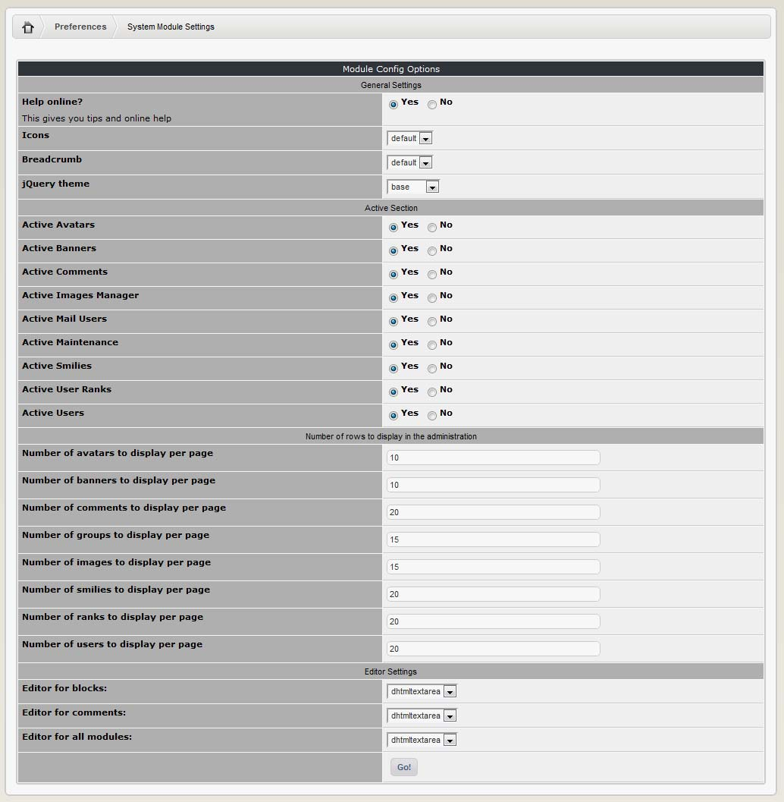

### 2.13.8	System Module Settings

This section is new in XOOPS 2.5.0 – it combines various options of the System module into one screen. Among the more important/interesting options:

|Field|	Description|
|--|--|
|Help Online?|	This gives you tips and online help|
|jQuery Theme|	Select the theme that you like for jQuery|
|Editor for Blocks, Comments, all Modules|	XOOPS comes with simple text editor, DHTML Editor, and TinyMCE (which is a WYSIWYG Editor). |

You can also activate/deactivate all sections of the Control Panel (e.g. Avatars, Comments, etc.), and specify number of rows for individual sections.

  
 
