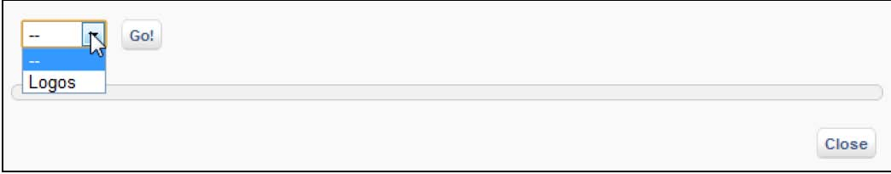
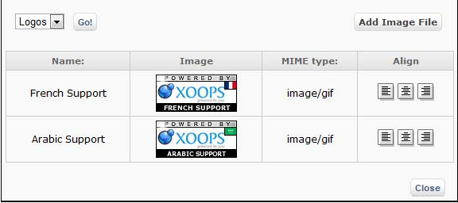
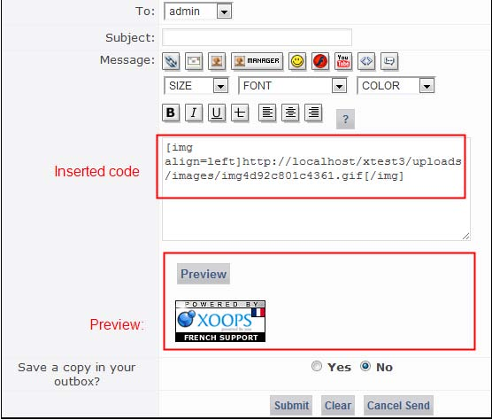

### 2.9.4	Accessing the image manager from the user side

The image manager can be accessed by the user in some modules such as news, downloads, links, forums and many others. This allows people to illustrate news stories and other resources that they submit. It is accessed by pressing the image manager button available in the submission forms of relevant modules, using the DHTML Editor: 

  
 
The Image manager opens in a new window where we can select a category:

  
 
Users can select image categories via a drop down box. The categories that users can see depend on the group to which they belong (and on the access rights that have been granted to that group).

  
 
When a category is selected a list of images is displayed along with three ‘alignment’ buttons (left, centre, right). Users choose an image to insert by selecting the appropriate alignment button next to it. This inserts the tags and URL needed to display the image into the submission form the user is working on. The window closes automatically.
 
   

If a user belongs to a group that has upload rights, an ‘Add Image File’ link is also available in the Image Manager window. This displays an upload form that allows users to name and browse to an image that they wish to submit. It also displays the constraints on image dimensions and file size that have been set for that category.
