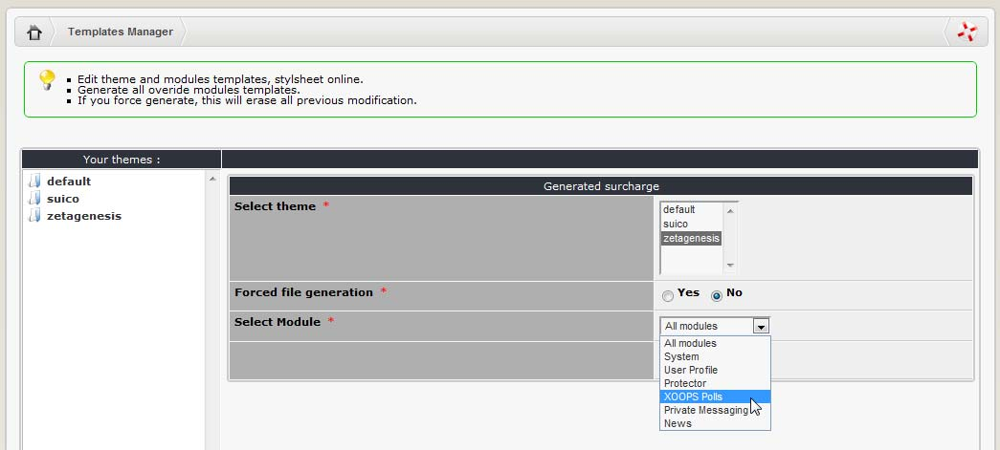
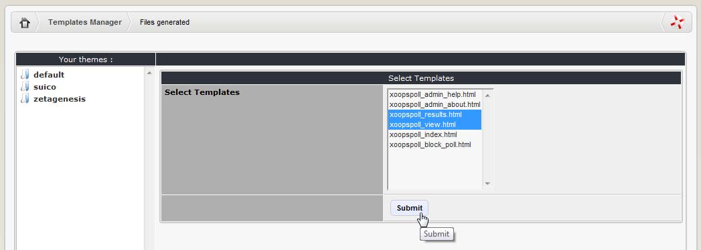
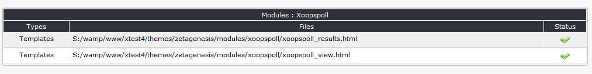
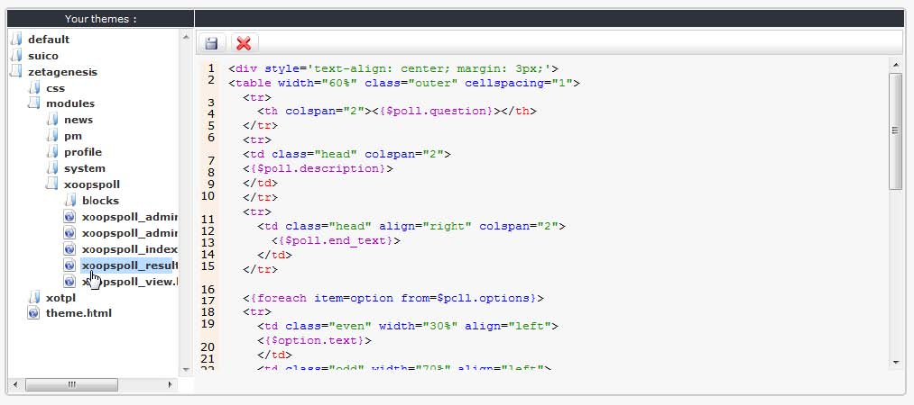

### 2.15.3	Editing templates

You can see a full list of available templates by browsing the directory TreeView. When you select a template, XOOPS will open it in an editor where you can edit it. 

While editing templates you must enable a preference that automatically updates module template .html files if there are newer files under the themes/your theme/templates directory for the current theme (System Module -> Preferences -> General Settings -> Update module template .html files from themes/your theme/templates directory? -> ‘Yes’). This should be turned off once the site goes public.

If you accidentally mess up a template don’t forget that you can retrieve a ‘good’ copy from the default template set. If you are working with non-standard templates it may be a good idea to save a copy to disk before you start modifying them. 
Let’s modify one of the templates coming with the XOOPS Poll module. To do so, let’s select the theme we want to modify the templates for (here: Zetagenesis):

  

As next, let’s select few of the XOOPS Poll templates: 

  

When we click on submit, the original templates from the module are copied to the theme directory:
 
 

Now selecting in the TreeView the Zetagenesis theme and XoopsPool in the modules directory, we can see the templates which can then be directly modified in an editor:
 
 

***Figure 22 Editing Template File***

The ‘submit’ button will save any changes you have made to the template.
