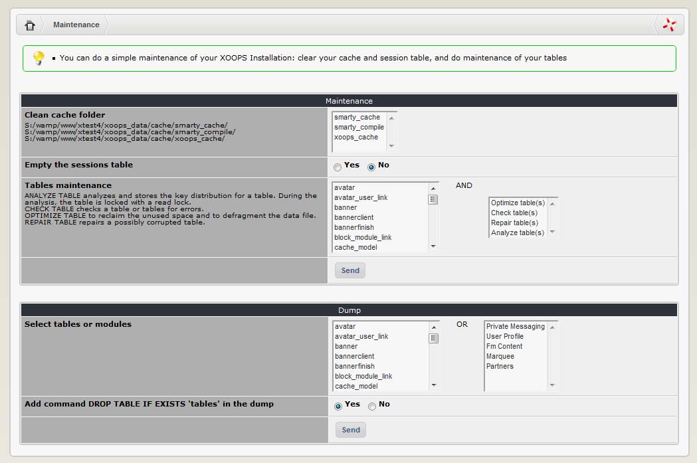

## 2.11 	Maintenance

Maintenance is a new addition in XOOPS 2.5.0. Its goal is to provide basic operations that are helpful to keep your Website healthy and efficient:

-	Clean Cache folders from old files, so there is no clutter there
-	Empty Session tables
-	Basic operation on tables:
    -	Optimize
    -	Check 
    -	Repair
    -	Analyze
    -	Dump or Backup of your tables

   

In the past you had to use external tools for this (e.g. phpMyAdmin), but now we can offer you extra convenience to do it from within XOOPS Admin.  

