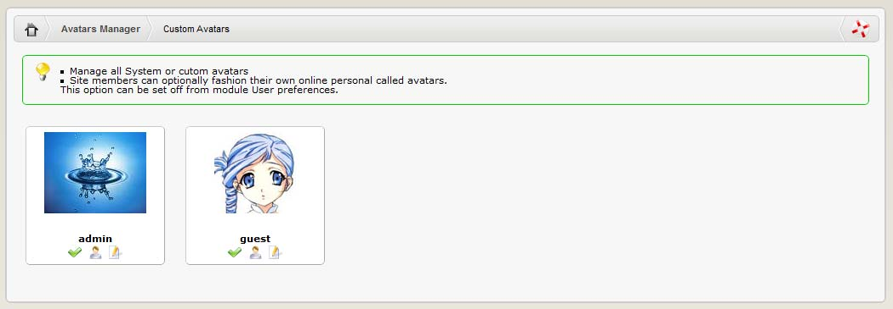

# Custom Avatars

The Custom Avatars are avatars directly uploaded by the users. For a user to be able to upload an avatar, the correct option must be configured in the User Info Settings of the Site Preferences: “Allow custom avatar upload?.”

In this screen the Admin can:

* Set the display of the avatar “on” or “off”
* Show who is using this avatar
* Edit info about the avatar \(e.g. change the name\)
* Delete the avatar permanently \(currently not available\)

