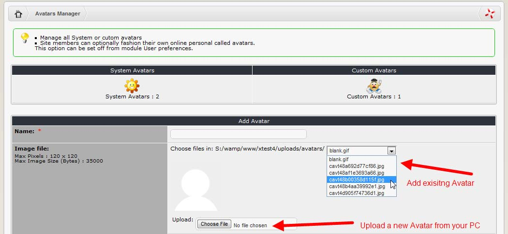
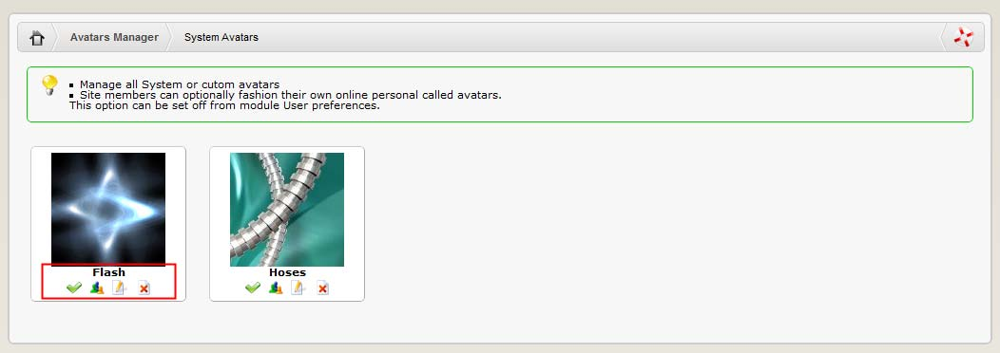

# System Avatars

The System Avatars are avatars uploaded by Webmaster, and made available to the users for individual selection.

The Webmaster can upload several avatars to /uploads/avatars directory, which will be then available for adding to “System Avatars”, or he can upload a new avatar directly from his PC. To preview available System Avatars, please click on the “System Avatars” icon to open this screen:

Under each of the Avatars, you’ll have four possible actions:

* Set the display of the avatar “on” or “off”
* Show how many people are using this avatar
* Edit info about the avatar \(e.g. change the name\)
* Delete the avatar permanently

