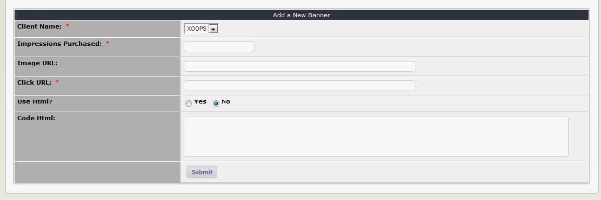

# Add new banner

You can add new banners to your website by clicking on the “Add a new banner” button, which will open this form:

The fields are as follows:

| Field | Description |
| --- | --- |
| Client Name: | Assign the ownership of a banner via this drop down box. The client must be registered first! |
| Impressions purchased: | Enter the number of impressions the client has paid for here. Enter ‘0’ to give them unlimited impressions \(this is useful for your own advertisements, or arrangements based on time rather than impressions\). |
| Image URL: | Enter the URL to retrieve the banner here. |
| Click URL: | Clicking on the banner will open the URL assigned here. This would normally be the client’s website or a page describing the product. |
| Use HTML? | You may wish or need to use HTML in your banner. Check this box to enable it \(it is disabled by default\). |
| Code HTML: | If you want to use HTML, enter it in this box. |

