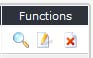

# Editing banners

Click on the middle ‘edit’ icon to open a form that displays the banner and its details. The fields are almost the same as above and may be changed freely. The only difference is that the ‘Impressions Purchased’ field is now called ‘Add More Impressions’; and the number of impressions already paid for / used is also displayed. You can reduce the number of impressions purchased by entering a negative number.

