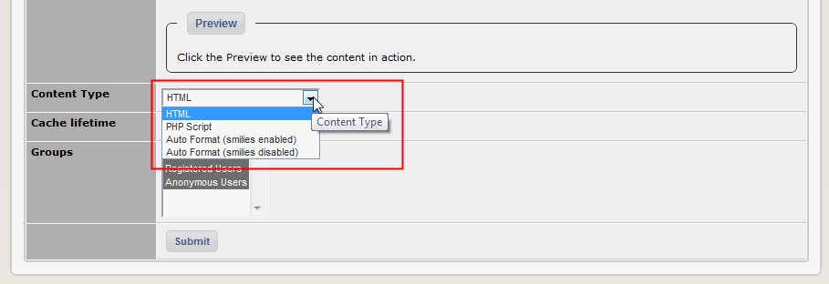
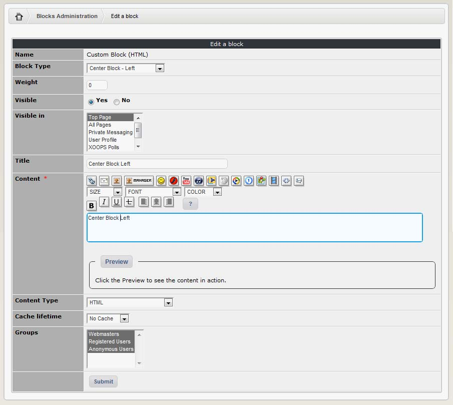

# Adding custom blocks

As we said before, the Blocks Administration page allows the Site administrator to add custom blocks. This is done by clicking on the “Add Block” button  and filling the fields in the screen from that opens. The properties are the same as the Table 2. Only one new property has to be set: Content Type, which defines the type of content that is entered in the Content area: HTML, PHP, etc…

And, of course, the content itself:

