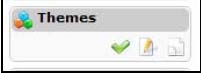
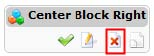
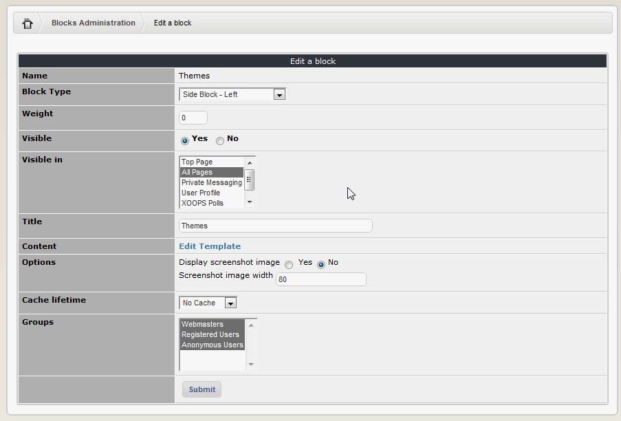
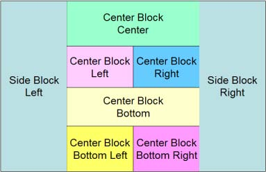

# Editing/Configuring a block

Each block provided by XOOPS or its modules has three options:

| Icon | Function |
| --- | --- |
|  | Visible on/off |
|  | Edit |
|  | Clone |

In Custom Blocks you have also a Delete option: 

When we click on the “Edit” icon, this will display the detail properties of the block and allow editing of some of these:

Here are the properties and their descriptions:

| Field | Description |
| --- | --- |
| Name | This is the name of the block. It cannot be modified here. |
| Block Type | The position of the block. One of the eight ‘options’ must be selected for each block. For an easier explanation you can see the image below:   _**Figure 12 Blocks Position**_   If no blocks are displayed in the right section of the page, the central section will start at the end of the left section and will expand to the end of the page. However, if no block is displayed in the left section, it will not affect the width of the central section and the left section will just be blank. It is, of course, not recommended to leave the left section with no block. Also, the blocks that are defined with option “Center Block Center” will always be displayed before the blocks that are defined with options “Center Block Left” and “Center Block Right”. |
| Weight | The weight is the value used by XOOPS to sort the display order of blocks in a page. The sorting is done by section. This means that the weight of a block in the left section will not affect the order of a block in the right section. The normal page is divided into four sections;   1-The top panel, or banner.  2- The left hand section, or main navigation bar.  3- The centre panel, or main page content  4- The right panel, or second navigation bar.   The general principle is the following: the higher the number, the lower the block will be. It is indeed exactly like weight in real life: heavier things go down faster. It is useful to input your block weight in 5 or 10 increments. This allows for inserting items later without needing to change other weights. |
| Visible | For a block to be displayed, it has to have its visible property set to ‘Yes’. |
| Visible in | This property sets the pages where the block will be displayed. In addition to all the modules, the combo box items have ‘Top Page’ and ‘All Pages’. The ‘Top Page’ will display the block only in the top page; the ‘All Pages’ will display the block in every page of the site. Selecting multiple, non-consecutive pages is possible by holding “Ctrl” on keyboard. |
| Title | This is the title that will be displayed in the webpage for the block. |
| Content | If this is a Custom Block that you’ve added, you can enter the content here \(e.g. HTML or PHP code\), otherwise you’ll have a link to the Template Manager where you can modify the template. |
| Options | Many blocks have options that can be set to fully customize the block. As the options are different for each block, we will not detail each one of them here. |
| Cache lifetime | Cache lifetime is a useful feature for making a site run faster. If a block has fixed content that is unlikely to change on a regular basis, it is possible to instruct the browser to call the content from cache, rather than from the server. This is particularly effective if graphics are part of the content. Use the settings here to determine how long this content should be held in cache before returning to server fed data. |
| Groups | Select which groups you want this block to be visible for |

**Table 2: Block Editing**

