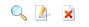

# Manage comments

The List Comment table displays the comments that correspond to the previous filters. Here is the description of the different columns:

| Column | Description |
| --- | --- |
| Title | The title of the comment. Clicking on the title of the comment will display the actual comment. |
| Poster | The registered username of the person who posted the comment. Clicking on the username of the comment will display the profile of this user. |
| IP | This is the IP address of the computer from which the comment was posted. |
| Date | The date and time that the comment was originally posted. |
| Module | This is the module from which the comment originated. |
| Status | This column displays the status of the comment, as previously explained. |
| Action |        You can View, Edit, or Delete the comment |

_**Table 2 - List Comment**_ The Site administrator can delete a comment by clicking on the ‘Delete’ link in the last column of the table.

The Site administrator can also edit the comment by clicking on the ‘Edit’ link. This action will display a page where all the comment properties can be edited.

If you’re dealing with a spammer who posted many spam comments, you can click on the top checkbox which will automatically select all comments, and click on the “Delete” button to delete them all:

