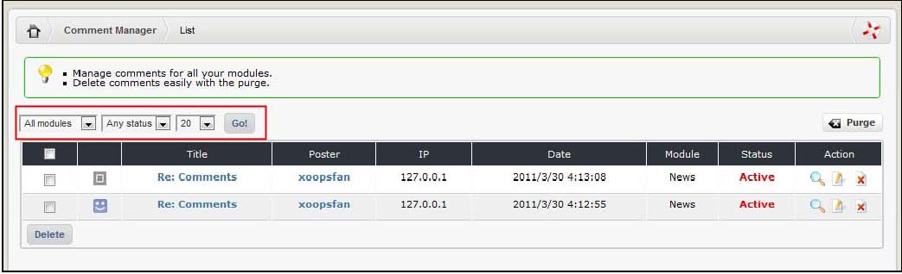

# Overview

The Comment Manager allows the Site administrator to edit and delete any comment that has been posted to the site, originating in any module that supports the comments feature. Like the Blocks Administration page, some filters options are available to help the site administrator manage the comments. New in 2.5.0: You can now select several comments and delete them at once

Let’s have a look at these filters operated from three combo box menus. :

_**Figure 13 Comments Filtering**_

**a\) Menu 1. Module**

By selecting a particular module, the ‘List Comments’ will display the comments that were posted in the selected module.

**b\) Menu 2. Status**

By selecting a particular status, the ‘List Comments’ will display the comments that have the selected status. Here are definitions of the possible status options:

| Status | Definition |
| --- | --- |
| Pending | By default, when a comment is posted, it has to be activated by the Site administrator in order to be displayed on the site. Comments that have not been activated keep this status. Note that automatic activation of comments can be set in the settings of each module that supports comments. |
| Active | Comments that have been activated by the Site administrator have this status. These comments are now displayed on the website |
| Hidden | The Site administrator can hide a comment by turning its status to hidden. A hidden comment will not be displayed on the website. |

Table 1 - Comments Status

**c\) Menu 3. Number of results**

This is the number of comments that the Comment List will display on the page at the time.

