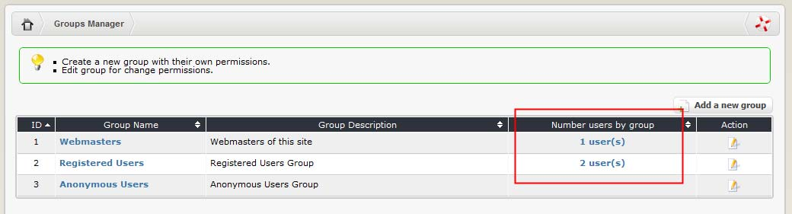

# Edit members of this group

You can also edit members of each particular group. The number of users in each group is listed in the main “Groups Manager” screen:

By clicking on the link, you’ll be transferred to the “Users Manager” screen, which will filter out all individuals belonging to that group:

You can make changes to the user’s group membership \(add to or remove from any group\) by clicking on the Edit icon and making changes in the User Profile:

The XOOPS Core Development Team recommends that each user be part of only 1 group. Doing this, you’ll be assured that no conflicts occurred.

