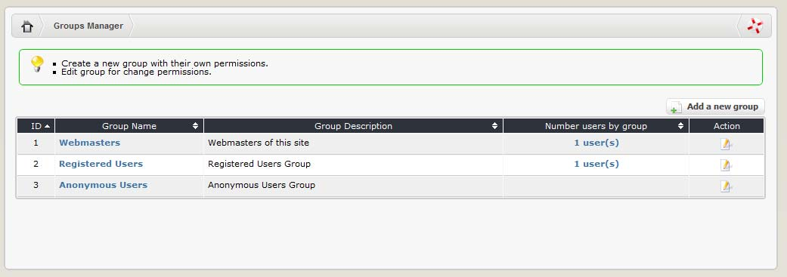

# The different sets of rights

Go to System admin&gt;groups&gt;”Groups” page. The ‘Groups Manager’ page begins with a section called 'Edit Groups’ \[Figure 14\]. This allows you to select a specific group to work with and modify. Initially 3 default groups already exist, as described above. Select a group from this list and click on the “Edit” icon.



_**Figure 14 Edit Group page**_

The modify group page is returned. \[Figure 15\] You can now change the name of this group and give a meaningful description in the form boxes provided.


Figure 15 Modify Groups page

Looking further down the page you will see 4 sections, which represent the 4 sets of rights that can be defined in the permission system. In every section, ticking a checkbox will grant this group the rights as described. If the checkbox is unchecked, this group will not have access to the selected resource.

```text
Note: Whenever you make changes to the settings on a page, you must click the 'Submit' button at the bottom before changes take place.
```

Let’s look at each set of rights individually.

**d\) System Admin Rights**

As their name says, System Admin Rights are rights that will control access to the System module. Each item in this sections represent an item found in the Administration Menu&gt;System Admin&gt;Preferences menu. In order to see the System Admin module in the Administration Menu&gt;”Control Panel Home” page, at least one item has to be checked in this section!

**e\) Module Admin Rights**

Each item in this section represents a module that has been installed on your site. When a module is checked, the group will have access to the administration page of that module. For example, let’s say that a particular group only has the “Forum” and “Downloads” items checked in the Module Admin Rights section. When a member of this group goes to Administration Menu&gt;”Control Panel Home”, he only sees 2 modules displayed: “Downloads” and “Forum”. As mentioned in the previous paragraph that member would also see a third module called “System Admin” if at least one item is checked in the System Admin Rights of his group.

**f\) Module Access Rights**

The same as for the Module Admin Rights, the Module Access Rights section lists all the modules currently installed on your site. In order for a group to access a particular module, the corresponding item must be checked in the present section. In addition to not being able to access a module which item has not been checked, the members of the group will not even see that module through the Main Menu. For example: if, for the anonymous users group, the ‘News’ module is checked, when they visit your site, the ‘News’ module will be shown in the main menu and they can access the content \(pages\) of ‘News’. If the ‘Forums’ module is unchecked it will not show up in the main menu, and they will not be able to access any content in the ‘Forums’ module.

However, using the search function, a member of this group will be able to perform a search in module for which his group does not have access. Of course, the member will only be able to see the title of the items returned by the search and will not be able to actually access the item.

**g\) Block Access Rights**

If a module has specific blocks that are available as part of its functionality, they will appear in this section. Each block can be assigned a position on the page \(this is detailed in the block section of this manual\) If we have already assigned a page position to a block, it will be seen in that position in the “Block Access Rights” section.

Each block displayed is given a system ID number. The name is also a hyperlink to a 'block edit' page. For further information on the Block Edit page, please see section 2.5.

