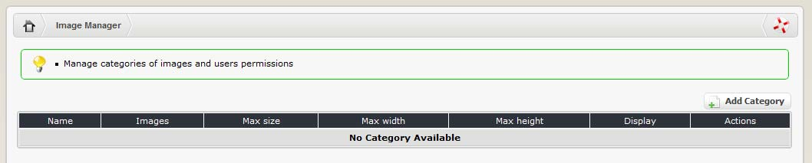

# Image Manager

The image manager is a tool that enables people to upload, organise and retrieve images for use throughout the site. You must configure the image manager before you can use it \(via System --&gt; Image Manager\). This involves creating some categories to store your images and setting preferences on issues such as maximum image dimensions, file size and user group access rights. Each category is configured separately.

