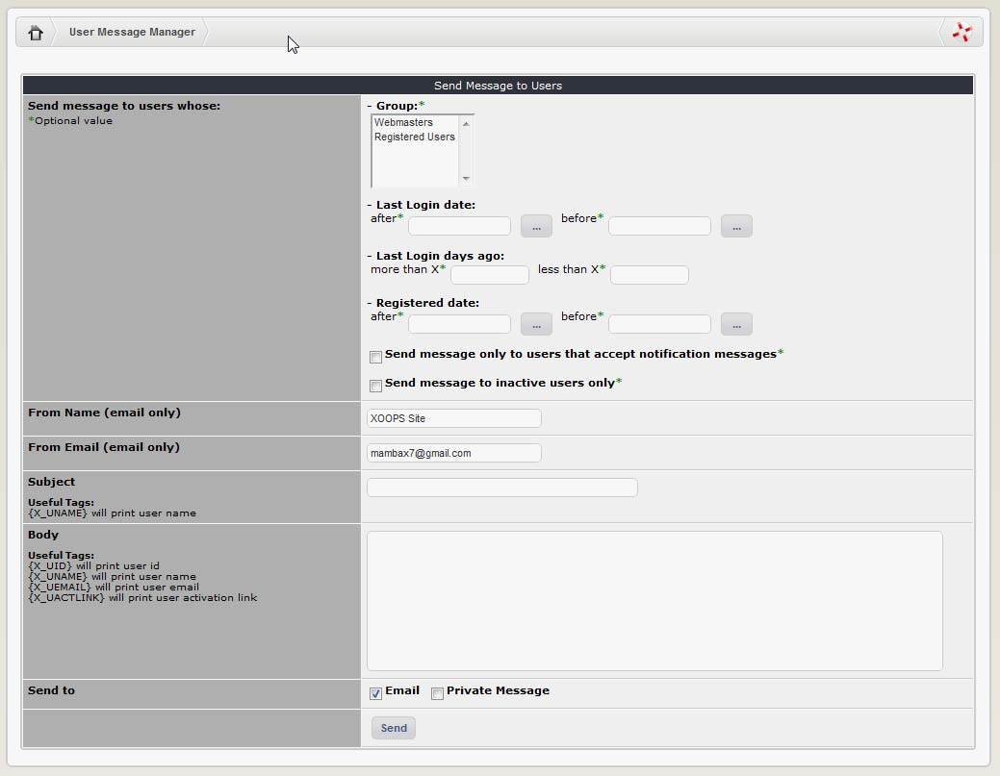

# Mail Users

XOOPS has a built in messaging system that enables you to send a message to your entire registered user base or subgroups thereof. This can be in the form of a private message \(i.e. through the XOOPS built-in messaging system\) or through an email. A range of options is available for filtering out subgroups of users from your membership:

| Field | Description |
| --- | --- |
| Send message to users whose: |  |
| Group is: | Select one or more of your registered user groups you wish to mail \(select multiple groups by holding down the shift or control keys\). The default groups are Registered Users and Webmasters. You can define additional User Groups in System-&gt;Groups \(refer section 2.3.6\) |
| Last Login is after \(Format yyyy-mm-dd, optional\) | You can use this to filter out members that used the site after a certain date. |
| Last Login is before \(Format yyyy-mm-dd, optional\) | You can use this to filter out members that have not used the site since a certain date – this can be a useful way to help maintain contact / send reminders to people who haven’t visited for a while. |
| Last Login was more than X days ago \(optional\) | You can use this to filter out members that have not used the site for a specified period. |
| Last Login was less than X days ago \(optional\) | You can use this to filter out members that have recently used the site within a specified period. |
| Send message only to users that accept notification messages \(optional\) | When people fill in the XOOPS registration form there is a check box they can use to indicate whether or not they are willing to receive occasional messages from administrators and moderators. Select this checkbox to respect the wishes of your members \(a good idea\). If you do not select the checkbox \(which is the default\), all of your members will receive the message whether they want to or not. Some of them may not appreciate that. |
| Send message to inactive users only \(optional\) | Select this checkbox to target inactive users only. If you use this option all of the other settings that lie above it in the table will be ignored. An inactive user is someone who registered an account on your website, but never actually activated it. |
| Registered date is after \(Format yyyy-mm-dd, optional\) | This enables you to filter out your more recent members, i.e. those that joined after a certain date. |
| Registered date is before \(Format yyyy-mm-dd, optional\) | Filters out your older members, i.e. those that joined before a certain date. |
| From Name \(email only\) | Enter the name that you want the message to appear to have come from here. |
| From Email \(email only\) | Enter your email address here. |
| Subject | Type the subject line of your message here. You can customise the message to include the name of each user by using the tag: {X\_UNAME} will print the user name For example, if you send a bulk mail with the subject line “Hello {X\_UNAME}” to users Bob and Sandy, Bob’s copy would say “Hello Bob” and Sandy’s would say “Hello Sandy”, and so on It’s similar to doing a mail merge in a word processor. |
| Body | Enter your actual message in this field. There are a few more tags you can use here to customise your message for each user that receives it \(see above\):{X\_UID} will print the user’s id {X\_UNAME} will print the user name {X\_UEMAIL} will print the user’s email {X\_UACTLINK} will print the user activation link \(good for sending reminders to inactive users – those people that have registered but not activated their account\) |
| Send to | You can choose to send your message via email \(in which case it will be delivered to the email address the member’s personal profile\), or by private message \(in which case it will appear in the member’s Inbox – accessible through the User Menu - next time they log on\). |

