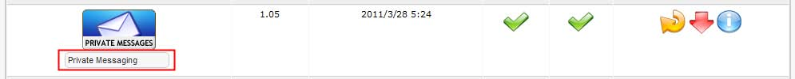
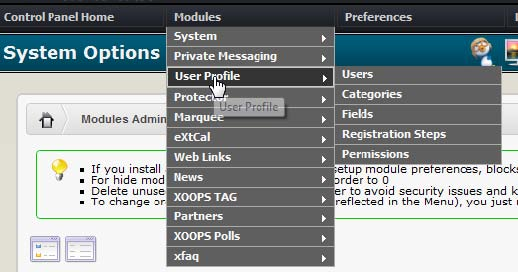

# Configuring module settings and options

Assuming you have not uninstalled your new module, let’s go back to System admin&gt;Modules. Modules administration page where your new module is displayed in the active section and continue with the setup procedure.

## 2.12.5.1    Renaming module

Your new module will now appear in a table in the upper section of the module administration page indicating a successful installation. \[Figure 20\]

Beneath the module icon you will see the module name in a small form box. You can rename the module here by inputting this form. The name supplied here will be the name displayed your site’s main menu. This can also be changed elsewhere in the configuration, as we will see later.

_**Figure 20 Module menu**_

When hovering or clicking on the module menu on top of the page, some Modules will display a menu with links to specific settings and options only for that module:

Some modules do not have an administration menu, in which case no menu is displayed.

Each module has individual functions and display options. Unless you have documentation for a module, you will need to experiment and explore the various options for using the module. The following guidelines are for configuring the module within the system and not related to the particular workings of any one module.

## 2.12.5.2    Display and position options for the module

Go to system admin&gt;blocks administration page. This next section assumes the module is correctly installed and that no error messages were encountered during the install process. Many modules share common properties with blocks, already described in section 3.3 in this manual.

These are typically:

* The position of where the block is displayed on the web page. 
* Which pages the block will be displayed in.
* Which user groups are allowed to see the block

Please refer to section 3.3 above for configuring these options. Some modules have different components for their operation. Thus, for example a news module is divided into 4 blocks:

* Top news 
* Big story 
* Other news 
* News topics

In these cases each block will be identified in a 'block description' and the module it relates to in the 'module column' of the blocks administration page.

