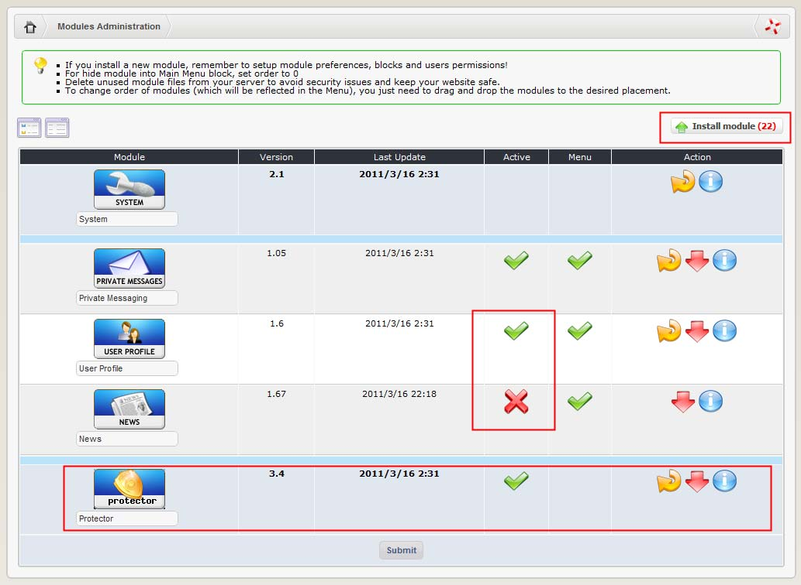
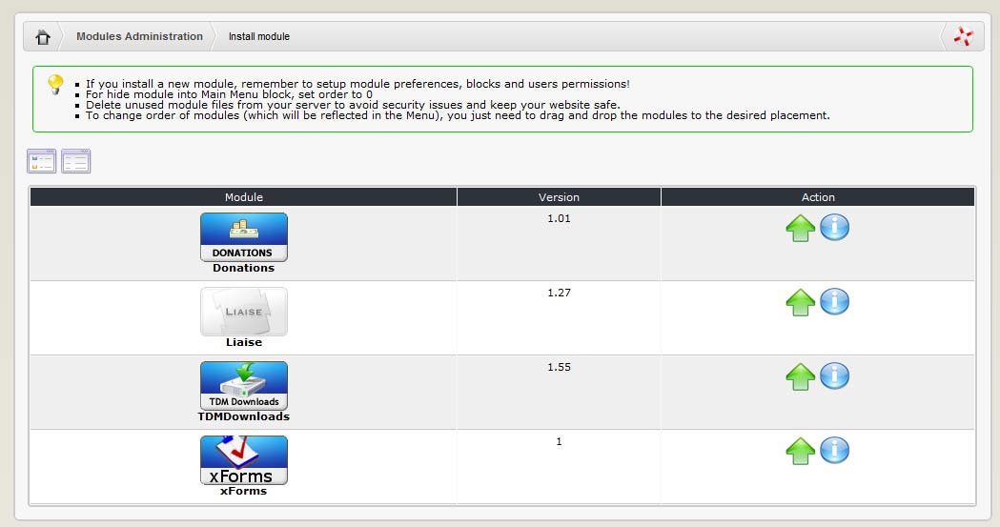
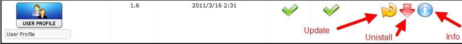

# Installing the module

Once the file set is uploaded and permissions are set if required, you can now visit your **Control panel home page** and install the module. Go to **system admin&gt;modules. Module administration page** \[Fig.1\]

_**Figure 16 Module Administration**_

This section displays a table with any installed modules. On top there is a button “Install Modules” with a link to a section displaying any modules residing in the ./modules/ directory on your server that have not been installed:

Your new module should be listed here with a ‘module’ under the module column, and an ‘install’ and ‘information’ icon under the 'Action' column.

Click the 'install' icon. This returns a confirmation page, click on the install button if you wish to proceed. If all goes well, you will see a new page with a list of files and any database tables created for your new module.

Click ‘return to module administration’ page.

You will now see your installed module in the top list of active installed modules. After the module is installed, you’ll be able to Update it, and un-install it.

_**Figure 17 Update and Un-install a module**_

