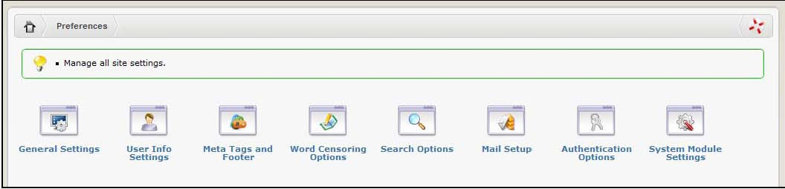

# Preferences

The preference panels are where you configure your site-wide preferences. It is worth taking the time to work through them as some settings can have a significant impact on the performance, security and ease of use of your site.

