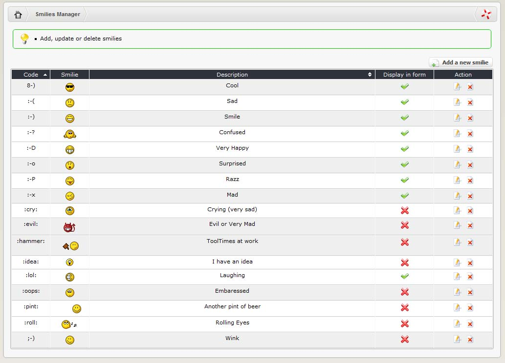

# Smilies

## 2.14.1    Using smilies

Smiles are little graphic symbols that people can use to express themselves  . They can be inserted anywhere in the text of an article, comment or post from both the user and admin sides of the system. XOOPS ships with a collection of 17 smilies built in. Some of these are displayed on the submission forms in various modules \(including forums, news, downloads, links and others\). Clicking on a smilie will insert it into the post. Smilies can also be inserted by typing in their unique ‘codes’ \(keyboard shortcuts\), for example typing :-D in a post will insert this smilie: 

The full list of smilies available on your system and their codes is accessible through the Smilies section of the System Module. Here you can add, edit and delete smilies, and control which are displayed on submission forms \(only nine of the 17 are displayed by default\) If you don’t want smilies on your system, you can either uncheck the ‘display in form?’ box \(in which case they won’t appear on submission forms, but will still be available via their codes\), or use the ‘delete’ link to remove them entirely.

