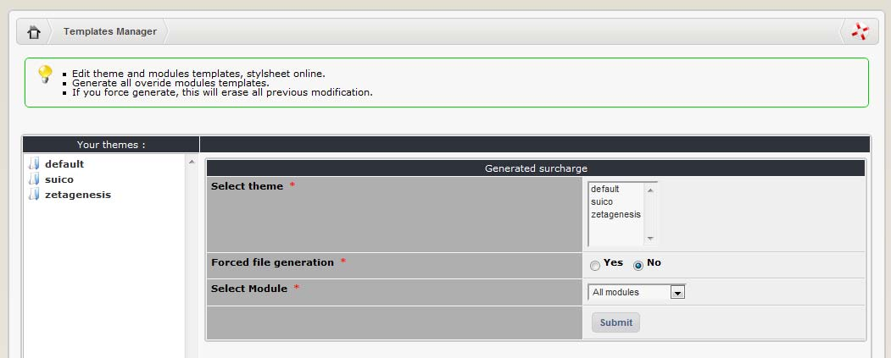

# Templates

If you want to tweak the layout of your site this is where you do it. The Template Manager \(System Module -&gt; Templates\) allows you to add, delete, edit and duplicate the HTML templates that control block and module layout. Note that you specify the active template set elsewhere - System Module -&gt; Preferences -&gt; General Settings -&gt; Default Template Set\).

XOOPS allows for some separation between the actual presentation of the site \(the “skin” or user interface\) and the code that runs in the back. The first one is handled by a sophisticated mechanism based on graphical themes. A theme may include, in its basic form, the essential HTML templates that define the visual interface of the site, as well as the style sheets and images needed to complement that visual interface. Themes are switchable in the administrative interface, so changing the whole appearance of a XOOPS site it’s just a matter of changing the value of a selector and clicking on “Accept”. XOOPS also provides site administrators with the ability to let users choose among some available themes.

Generally speaking, a theme is the high level visual framework of a site: the theme defines, for instance, the general layout of the site; on the other hand, it does not usually define the specific distribution of content within a block. This is handled by a different entity called a template set. A template set is an ensemble of HTML templates that define the presentation of content within all the blocks that form a XOOPS Web site. If we want a more clear metaphor for this, we could say that the theme is like the architect of a house, while the template set is like the interiors decorator. The first one sets the walls and defines the general distribution, but it’s the second one who’s in charge of “dressing” those walls.

If the active theme is a simple one that only includes a theme file, CSS files and some images, XOOPS employs the default template set to define the presentation of blocks. However, some complex themes are sophisticated enough to include their own template set. In this case, the site administrator must use the administrative interface to set both the theme and the template set.

How is this theme magic accomplished? That is, how can HTML templates include dynamic content? This is done not with mirrors and smoke, but with a clever template engine called Smarty that makes the function of what used to be called variable interpolation. Expressed in a simple way, we could say that the XOOPS system uses PHP files to hold the logic of the modules \(access to the database, allocation of variables, management of rights...\), HTML files with Smarty variables inserted to manage the actual visual interface, and the Smarty engine to insert values and strings in specific places within the HTML that builds the pages seen by the end user. All in all, what this means to you can be easily summarized: thanks to its theming system, XOOPS lets site designers build more interesting and visually stunning sites without much concern about what happens under the hood.

_**Figure 21 Template Set Manager**_

