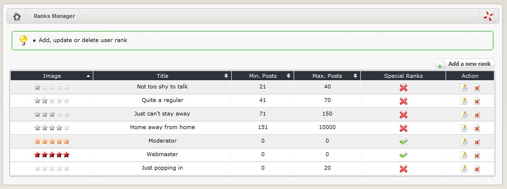

# User Ranks

User Ranks allow you to give people some ‘status’ based on either their role or level of participation in the community. It is important to note that user ranks are functionally irrelevant - they _do not_ confer any extra privileges or administrative rights at all – they are just titles. User access rights are actually controlled elsewhere \(through the Groups section of the control panel\). If you assign someone the Webmaster user rank but forget to also assign them to the Webmaster user group \(a common mistake\) they may look cool but they won’t be able to administer the site!

‘Normal’ ranks are assigned on the basis of the number of forum posts and comments a user has made. A user’s rank will change as they make enough posts to qualify for the next level. XOOPS ships with the following default ranks: Just popping in; Not too shy to talk; Quite a regular; Just can’t stay away; and Home away from home.

XOOPS also ships with two ‘special ranks’: Moderator and Webmaster. Special ranks differ in that they can be assigned to users irrespective of the number of posts they have made. A typical use of special ranks is to give recognition to people performing various administrative functions.

The ‘edit’ link allows you to change the name of a rank, to alter the minimum / maximum number of posts needed to qualify, to designate it as a ‘special’ rank \(or not\), and to upload a new rank image. You can remove unnecessary ranks \(‘delete’ link\).

You can create additional ranks through the form at the bottom of the user rank page. Simply assign a name, minimum and maximum number of posts \(if desired\), upload a rank image and assign it as either normal or special.

