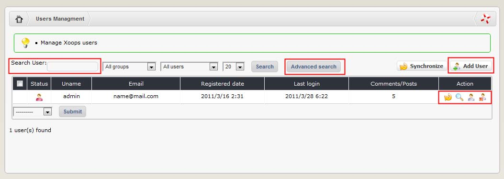
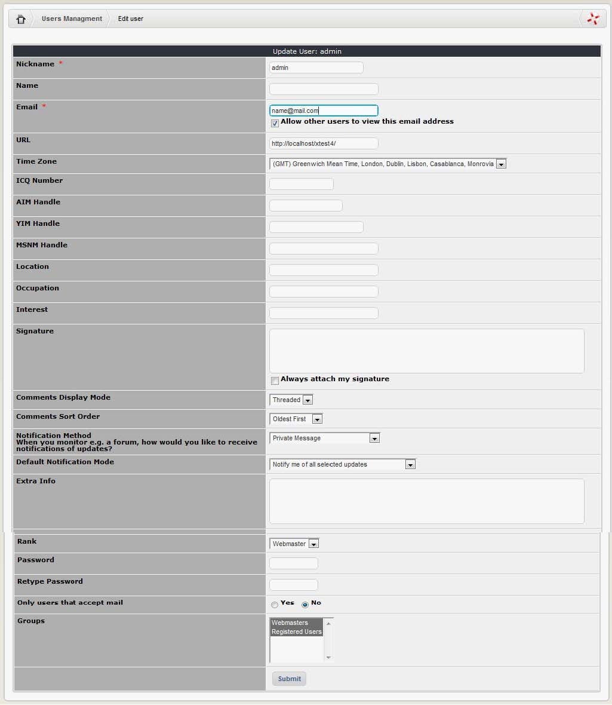
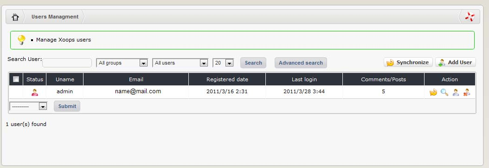
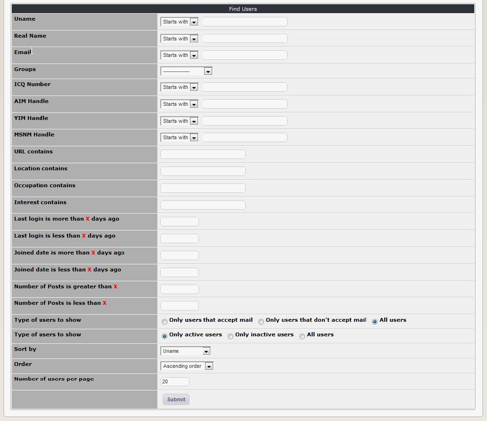

# Users Management

You can add, edit and delete users through this section of the System Module.

To edit a user, select their user name in the first drop down box on the page. You may then choose to either i\) modify their details or ii\) delete them using the second drop down box.

Selecting ‘modify’ will open the user’s profile which you may then change as you see fit \(note that you can also reach the edit profile page from the user side via the member directory, or by clicking on a username anywhere in the site\). The fields available are:

| Field | Description |
| --- | --- |
| Nickname | Their Username |
| Name | The User’s real name |
| Email | The User’s email address. There is a checkbox that can be enabled to allow others to view the address \(disabled by default; it is good practice to avoid posting your email address on websites as spambots will inevitably find it\). Note: If a user has contacted you complaining that they didn’t receive the activation email for their account, chances are that they made a mistake when typing in their email address. |
| URL | This is the User’s website address |
| Time Zone | The User’s time zone \(relative to Greenwich Mean Time\) |
| ICQ | The User’s ICQ member number |
| AIM | User’s America Online Instant Messenger username |
| YIM | Yahoo Instant Messenger username |
| MSNM | MSN Messenger username |
| Location | User’s home location \(usually a city or country\) |
| Occupation | Self-explanatory! |
| Interest | Information about the User’s personal interests |
| Signature | The User’s signature is text that can be appended to the end of a post or comment. Tick the checkbox to always attach the User’s signature to posts \(note that forums are sometimes configured not to allow signatures\). |
| Comments Display Mode | This field sets the User’s preference for viewing comments. Choices are nested, flat or threaded \(display modes are described in section 2.3.10: General preferences\) |
| Comments Sort Order | User’s preference for viewing comments – choose from oldest comments first or newest first |
| Notification Method: | Sets the User’s preference for being notified of events to which they have subscribed \(such as the addition of a new post in a particular forum, a news story in a particular topic etc\). Options are to be notified by private message \(in the User’s Inbox accessible through the User Menu\), via email, or to temporarily disable notifications. |
| Default Notification Mode | Sets the User’s preference for handling notifications. Select from I\) Notify me of all selected updates \(e.g. if two news stories are added in a category the User is subscribed to, they will receive two notification messages\); ii\) notify me only once \(multiple events in the same notification category will only generate one notification\); notify me once then disable until I log in again |
| Extra Info | Any extra information about the User |
| Rank | You can assign a ‘special rank’ to the User here |
| Password | You can enter \(or change\) the password for the user’s account here. Don’t forget to inform them, and ask them to change it immediately. |
| Retype Password | Confirm the password here |
| Receive occasional email notices from administrators and moderators? | User’s can let you know whether they are willing to hear from you or not. You can use this field as a filter in the Find Users section of the control panel. This preference is advisory only – you can still send messages to people who have selected ‘no’ \(it may be necessary, for example, if a security issue should arise\).  However, it is considered ‘good form’ to respect the wishes of your members. |

The number of user posts is shown at the bottom of the page. If the number does not seem accurate, there is a synchronisation button that you can press to update it.

**Adding users**

To add users simply fill in the registration form that comprises the second section of this page. The fields are the same as described above.

**Find Users: Simple Search**

If you know the user’s name, you can just type that name \(or just part of it\) in the “Search User” field, and press “Search” button. XOOPS will show you all users who meet the name criteria.

**Find Users: Advanced Search**

Find Users provides a wide range of options that you can use to search for specific users or to filter your membership. You can also obtain a complete list of members by pressing the ‘submit’ button without using any of the filters.

Most of the fields are self-explanatory but they are covered below anyway:

| Column | Description |
| --- | --- |
| User Name | Search by user name. This is one of the best fields to use since it is mandatory \(everyone has a user name, but most people don’t bother to fill out the discretionary fields in their profiles\). You have the following options to refine your search: Starts with \(default\); ends with; matches; contains. |
| Real Name | Search by real name. |
| Email | Search by email address. |
| ICQ Number | Search by ICQ member number. |
| AIM Handle | Search by America Online Instant Messenger username. |
| YIM Handle | Search by Yahoo Instant Messenger username. |
| MSNM Handle | Search by MSN Messenger username. |
| URL contains | Search by website address field of user profiles. |
| Location contains | Search by location field of user profiles. |
| Interest contains | Search the interest fields of user profiles. |
| Last login is more than X days ago | Use this to find people that have not logged in for a specified period. Bear in mind that \(depending on the group access rights you have set\) people don’t always log into your site to when they visit. |
| Last login is less than X days ago | Use this to find recent users of your site. |
| Joined date is more than X days ago | Useful to filter out your more established members. |
| Joined date is less than X days ago | This is useful if you want to filter out new members, perhaps to send them a personal welcome message. |
| Number of Posts is greater than X | Use this to find your top posters. |
| Number of Posts is less than X | Use this to find infrequent posters. |
| Type of users to show | There are three options here that you can use to filter your search results:  i\)    Only users that accept mail;  ii\)    Only users that don’t accept mail;  iii\)    All users \(default\). This relates to an option users selected when they registered their account. Bear in mind that people who chose not to accept mail don’t want to hear from you! |
| Type of users to show | There are three options that you can use to filter your search results:  i\)    Only active users \(the default, this means people whose accounts have been activated\);  ii\)    Only inactive users \(people who have registered but not yet activated their accounts\) and  iii\)    All users. |
| Sort by | You can use this to sort your search results. Available options are:  i\)    User name \(default\) ii\)    email iii\)    last login iv\)    joined date v\)    number of posts |
| Order | Another field for sorting your search results, you can choose from: i\)    ascending order \(default\) or  ii\)    descending order |
| Number of users per page | How many entries to show on each page. |

